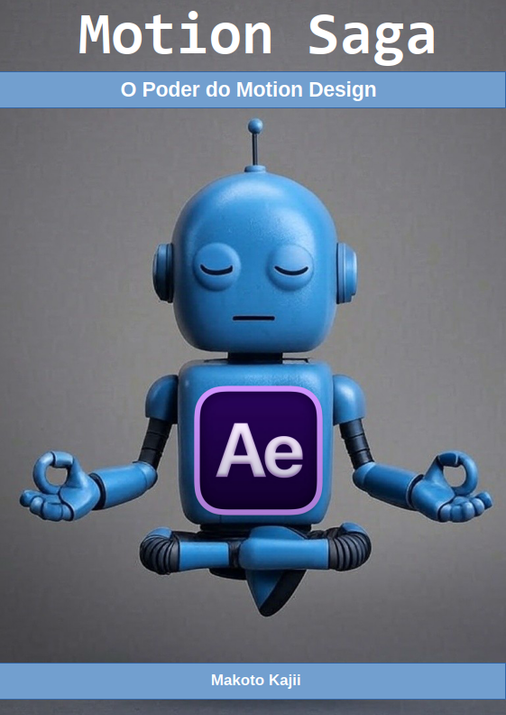

# Podcast-generate-by-ia
*"A persistência é o caminho do êxito." - Charles Chaplin"*

# *Projeto Podcast Gerado por IA*
> ℹ️ **Note:** Repositorio criado para o projeto do Podcast

Projeto visa utilizar IAs para o desenvolvimento do podcast, sendo o nome do podcast, roteiro e vozes.

## **🖥️Tecnologias**
  - [ChatGpt](https://chatgpt.com)
  - [Midjourney](https://www.google.com/url?sa=t&rct=j&q=&esrc=s&source=web&cd=&cad=rja&uact=8&ved=2ahUKEwibu-b-pbGQAxX7u5UCHSMgLJEQFnoECA0QAQ&url=https%3A%2F%2Fwww.midjourney.com%2F&usg=AOvVaw3grMcZQ-XDIBOtKA3oOlK4&opi=89978449)
  - [Grok](https://www.google.com/url?sa=t&rct=j&q=&esrc=s&source=web&cd=&cad=rja&uact=8&ved=2ahUKEwiRjPHT1LqQAxVWLrkGHcheAJAQFnoECBAQAQ&url=https%3A%2F%2Fgrok.com%2F&usg=AOvVaw1zlfw-7qpulRZL8NzxGRVt&opi=89978449)
  - [ElevenLabs](https://start.elevenlabs.io/brand/v1?utm_source=google&utm_medium=cpc&utm_campaign=brazil_brandsearch_brand_english&utm_id=22882469642&utm_term=eleven%20labs&utm_content=brand_-_brand&gad_source=1&gad_campaignid=22882469642&gclid=CjwKCAjwmNLHBhA4EiwA3ts3mUDZ3iiigRmfU4yv-av3DSXImTRLbsrnXkLDykfKN3ItOCNvZItAHhoCz6QQAvD_BwE)
  - [Suno](https://suno.com/)

## **📚Materiais**
- [Link Podcast](https://open.spotify.com/episode/6Wt1XDB3YCDjOkq1p9z6Ir?si=R9OJZsbvTwODMvk6mYhd5g)
- [Notion Template](https://www.notion.so/PPA-Podcast-Project-AI-295611d94309802f8b11db22b2a588af?source=copy_link)

## **💡Como foi feito?**
  - Nome e roteiro ChatGPT 
  - Audio narrado gerado pelo ElevenLabs
  - Som de fundo Suno
  - MidJourney, Grok para geração de imagens
  - Capcut para edição

## **👨‍💻Desenvolvedor**

  

    
    
&nbsp&nbsp&nbspMakoto Kajii     

 &nbsp&nbsp
  <a href="https://github.com/MakotoKajii">
  

